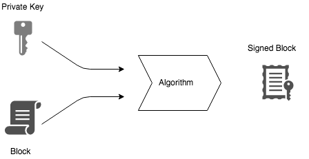
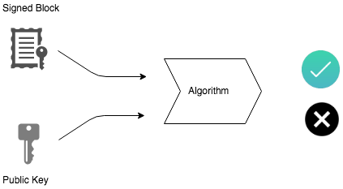
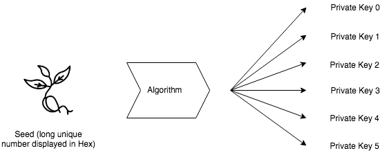

# Introdução

O foco desse guia é introduzí-lo ao Nano para que você possa ter — em alguns minutos — uma primeira impressão do que se trata essa incrível tecnologia.

# Sumário
- [Introdução](#introdu%C3%A7%C3%A3o)
- [Sumário](#sum%C3%A1rio)
- [Capítulo 1](#cap%C3%ADtulo-1)
  - [Mas o que diabos é Nano?](#mas-o-que-diabos-%C3%A9-nano)
  - [Obtendo uma carteira](#obtendo-uma-carteira)
    - [Smartphones](#smartphones)
    - [Desktop](#desktop)
    - [Armazene sua seed de forma segura](#armazene-sua-seed-de-forma-segura)
    - [Pronto, guardei minha seed](#pronto-guardei-minha-seed)
    - [Já tenho minha carteira, e agora?](#j%C3%A1-tenho-minha-carteira-e-agora)
  - [Compartilhe com seus amigos](#compartilhe-com-seus-amigos)
  - [Quero mais do que uma fração de Nano](#quero-mais-do-que-uma-fra%C3%A7%C3%A3o-de-nano)
  - [Onde gasto meu Nano?](#onde-gasto-meu-nano)
  - [Outras fontes](#outras-fontes)
- [Capítulo 2](#cap%C3%ADtulo-2)
  - [Entendendo Chaves e Seeds](#entendendo-chaves-e-seeds)
  - [Resumo](#resumo)
  - [O que são chaves públicas e privadas?](#o-que-s%C3%A3o-chaves-p%C3%BAblicas-e-privadas)
  - [O que é uma seed?](#o-que-%C3%A9-uma-seed)
  - [Como endereços XRB/Nano são gerados?](#como-endere%C3%A7os-xrbnano-s%C3%A3o-gerados)

# Capítulo 1

## Mas o que diabos é Nano?

Nano é uma moeda digital extremamente **rápida e sem taxas**. Nano também é **descentralizada**, ou seja, não há nenhuma entidade financeira a controlando e a manipulando.

## Obtendo uma carteira

Para início de conversa você precisa de uma **carteira**. Você pode imaginar a carteira como uma conta em um banco, mas sem o banco. Recomendo as seguintes carteiras para distintas plataformas:

### Smartphones

- [App Store](https://itunes.apple.com/us/app/natrium/id1451425707)
- [Play Store](https://play.google.com/store/apps/details?id=co.banano.natriumwallet)

### Desktop

- [Nanowallet.io](https://dotsomething.github.io/Nanowallet.io)

Ambas aplicações recomendadas possuem um processo bem intuitivo de criação da carteira, por isso não entrarei em detalhes de como configurá-las. Entretanto existem alguns pontos a se atentar.

### Armazene sua seed de forma segura

**Seed** nada mais é que a chave para sua conta. Sua seed é o backup de sua conta. Em caso de perda de sua carteira, ela será a responsável pela recuperação. **Então armazene-a de forma segura.**

*Se preferir utilizar a Nanowallet.io, você também deverá armazerar o ID de sua carteira que é utilizado para login.*

### Pronto, guardei minha seed

Após esses dolorosos dois minutos de criação de conta e configuração, você já deve ter visto o **endereço** de sua carteira que deve parecer algo como **nano_1g4xrb…qxbiw**. Você pode considerar esse endereço como o número de sua conta.

### Já tenho minha carteira, e agora?
Obtendo seu primeiro Nano

Agora que você possui sua carteira, com certeza você quer algum Nano, certo? Existem algumas **faucets** que distribuem uma pequena quantia de Nano. Essas são algumas:

- [Nano-Faucet.org](https://nano-faucet.org/)
- [FreeNanoFaucet.com](https://www.freenanofaucet.com/)
- [A Lil Nano](https://www.alilnano.com/)

Basta entrar, colocar o endereço de sua carteira e em alguns segundos (ou menos) você terá sua primeira porção de Nano em sua carteira.

*"Como assim algo grátis?"* você deve estar pensando. Não se preocupe, as faucets só distribuem algumas frações por usuário. Elas provavelmente recebem mais em doações do que gastam.

Ainda assim, existem outras faucets além das citadas acima.

## Compartilhe com seus amigos

Para realmente ver como essa tecnologia é incrível, ajude um amigo à configurar uma carteira e façam algumas transações entre vocês. Ele pode estar do outro lado do globo que você poderá mandar qualquer quantia de Nano a ele. Essas transações levarão somente alguns segundos, quão legal isso pode ser?

## Quero mais do que uma fração de Nano

Você provavelmente quer mais do que 0.001 Nano. Uma das maneiras mais rápidas para conseguir mais Nano é criando uma conta em uma corretora de cryptomoedas como a [Binance](https://www.binance.com/). Nela você pode comprar Bitcoin com seu cartão de crédito, trocá-lo em Nano e transferí-lo para sua carteira. Se você precisa de mais detalhes, a comunidade da Nano fica feliz em ajudar.

Existem maneira mais baratas do que a Binance, entretanto isso está fora do escopo deste guia.

## Onde gasto meu Nano?

Existem diversas maneiras para gastar seu Nano.

[Aqui](https://nanoisfast.com/websites-accepting-nano-payments/) está um site que provê uma lista global de lugares que aceitam Nano.

[Aqui](https://nanolinks.info/#merchant--donation-related-no-shops-too-many) está outra lista.

## Outras fontes

Você já possui um conhecimento básico e as primeiras impressões sobre Nano. Caso queira aprender uma pouco mais sobre essa tecnologia, o [site oficial](https://nano.org/en) é um bom ponto de partida.

Também há o [subreddit](https://reddit.com/r/nanocurrency/) onde você pode achar milhares e milhares de conteúdos sobre Nano. Você também pode encontrar maneiras mais baratas de conseguir Nano.

---

**Este capítulo foi totalmente inspirado pelo seguinte [guia](http://www.nano-guide.com/). Agradeço ao [u/radicalwash](https://www.reddit.com/user/radicalwash) pelo excelente guia.*

**Este capítulo não possui nenhum interesse comercial. Recomendações foram feitas baseadas em experiências pessoais.*

# Capítulo 2

## Entendendo Chaves e Seeds

Uma breve explicação sobre o sistema de seeds e chaves da cryptomoeda [Nano](https://nano.org/en).

## Resumo

**Nano** utiliza um sistema de **chaves públicas e privadas** para mandar e receber blocos, em outras palavras: *“Suas chaves, seu Nano. Não são suas chaves, não é seu Nano”*.

Uma **seed** é um longo número que pode ser usado para gerar diversas chaves privadas, com isso em mente, um **endereço** (leia-se conta) Nano é somente uma chave pública com um checksum que são interligados com a chave privada original.

## O que são chaves públicas e privadas?

Chaves públicas e privadas são parte vitais de uma criptomoeda e provêem um método de posse das moedas e token. **São números únicos e longos demais para ser adivinhados** que funcionam como chaves e dão acesso ao usuários.

*É interessante frisar que seus Nano não são armazenados em sua carteira! Na verdade, eles existem na rede e sua carteira simplesmente possui as chaves para manipulá-los.*

Nano usa um padrão bem estabelecido de chaves públicas e privadas. Uma chave privada é usada para “assinar” transações no bloco. Essa chave privada possui uma chave pública que é diretamente ligada a um endereço. O único método para criar uma transação ligada à uma carteira é assinar esse block com uma **chave privada** — com Nano isso pode ser enviado e recebido.

Como a chave privada é única, quando com o bloco é criada uma única assinatura. A chave pública correspondente pode ser usada para verificar se a assinatura está correta, entretanto, se você tentar criar um bloco assinado com uma chave privada incorreta, será fácil para a rede rejeitar esse bloco.

Isso significa que os usuários não precisam dar suas chaves privadas para a verificação, somente as chaves públicas.

## O que é uma seed?

Uma **seed** (ou *semente*) é uma forma fácil de gerenciar diversas chaves privadas. Ao invés de termos muitas e muitas chaves privadas, você possui um longo número chamado seed que será executado contra outro algorítmo que será responsável por gerar outras chaves privadas (e suas correspondentes chaves públicas). As chaves privadas são geradas em sequência, ou seja, sua primeira chave sempre será a primeira, a segunda sempre será a segunda e assim em diante.

Esse processo permite que você recupere suas chaves e seus Nano com uma única seed.

## Como endereços XRB/Nano são gerados?

Seu endereço Nano ( começados em *xrb_* ou *nano_*) são suas chaves públicas e um checksum. O checksum torna fácil o processo de verificação de autenticação da conta, ou seja, verificar se é uma conta válida ou não. É possível ver uma conta através de uma chave pública e vice-versa

Em resumo:

- Um endereço é ligado à uma chave pública através uma chave privada
- Em um bloco Nano, cada endereço possui seu próprio blockchain. Isso que permite a reutilização de seu interesse

---
**Esse capítulo foi totalmente traduzido a partir desse [post](https://www.reddit.com/r/nanocurrency/comments/aoe0me/nano_how_1_seeds_and_keys/) no reddit do usuário [u/jayycox](https://www.reddit.com/user/jayycox). Todos os créditos são dele.*